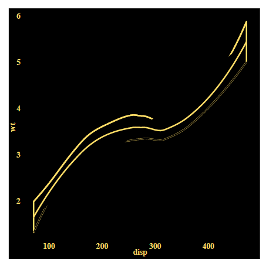

```{r, include = FALSE}
library(tidyverse)
library(devtools)
```

# Context

I am working on adding more gpglot layers to be shown by the XML webpage.

I am working in my fork at the moment on this branch: [0.33.4-SVG-update-ggplot](https://github.com/1jamesthompson1/BrailleR/tree/0.33.4-SVG-update-ggplot). Although I will try to put code snippets in where relevant.
```{r messages = FALSE}
install_github("https://github.com/1jamesthompson1/BrailleR/tree/0.33.4-SVG-update-ggplot")
library(BrailleR)
```

In general I dont really know how the SVG, XML and JS all work togather to produce the result. In trying to add these in and such it has been trial and error of adding in various tags in different places in the XML document to see how it changes the output.

I have not dug into the js at all as js is not something that I work with much and it looks a bit complex (as well as slightly obfuscated?).

# Problem

So far I have them all working from a totally blind persons perspective. It works that when there are more than 5 items in the layer then it will summaries the data and only provide 5 "sections" to click through.

However I am struggling to get some of the layers to display correctly.

These are the smooth layers and point layers.

Both of the attempts at solutions are of similar structure to Debra Warrens solution to getting the geom_line to work as wanted. This is by making the main annotation a fake id with the graphic wanting to be displayed at all time a component in a separate annotation. It can be seen in the .AddXMLLines function.

## geom_smooth

For the smooth layers I have the line displaying correctly.

I cant seem to get the polygon graphic object to display.

Now my goal is to have the line and se display the whole time you cycle through the various sections.

To get the svgs and the XMLs that are below you can use this code:
```{r}
smooth_area = ggplot(mtcars, aes(x = disp, y = wt)) +
  geom_smooth()
MakeAccessibleSVG(smooth_area, cleanup = F)
```

The svg for a simple geom_smooth layer looks like this (I have removed most of the points for brevity):

``` XML
    <g id="geom_smooth.gTree.177.1">
                      <g id="geom_ribbon.gTree.174.1">
                        <g id="GRID.polygon.171.1">
                          <polygon id="GRID.polygon.171.1.1" points="49.84,115.26 55.25, ..." fill="rgb(153,153,153)" stroke="none" stroke-width="0" stroke-dasharray="none" stroke-linecap="butt" stroke-linejoin="round" stroke-miterlimit="10" stroke-opacity="0" fill-opacity="0.4"/>
                        </g>
                        <g id="GRID.polyline.172.1">
                          <polyline id="GRID.polyline.172.1.1" points="49.84,115.26 55.25, ..." stroke="none" stroke-width="2.13" stroke-dasharray="none" stroke-linecap="butt" stroke-linejoin="round" stroke-miterlimit="10" stroke-opacity="0" fill="none"/>
                          <polyline id="GRID.polyline.172.1.2" points="477.15,396.41 471.75, ..." stroke="none" stroke-width="2.13" stroke-dasharray="none" stroke-linecap="butt" stroke-linejoin="round" stroke-miterlimit="10" stroke-opacity="0" fill="none"/>
                        </g>
                      </g>
                      <g id="GRID.polyline.175.1">
                        <polyline id="GRID.polyline.175.1.1" points="49.84,84.19 55.25,93.4 60.66,102.4 66.07, ..." stroke="rgb(51,102,255)" fill="none" stroke-width="2.13" stroke-dasharray="none" stroke-linecap="butt" stroke-linejoin="round" stroke-miterlimit="10" stroke-opacity="1" fill-opacity="1"/>
                      </g>
                    </g>
```

My current attempt to try get this to happen is having a XML structure like this:
```XML
    <sre:annotation speech="slope range: (3.58e-03,1.215e-02) median: 7.151e-03 CI width: 4.583e-01" speech2="slope range: (3.58e-03,1.215e-02) median: 7.151e-03 CI width: 4.583e-01">
      <sre:active>GRID.polyline.175.1.2</sre:active>
      <sre:position>2</sre:position>
      <sre:parents>
        <sre:grouped>center-1-1</sre:grouped>
      </sre:parents>
      <sre:children/>
      <sre:component>
        <sre:passive>GRID.polygon.171.1.1</sre:passive>
        <sre:passive>GRID.polyline.172.1.1</sre:passive>
        <sre:passive>GRID.polyline.175.1</sre:passive>
      </sre:component>
      <sre:neighbours/>
    </sre:annotation>
    <sre:annotation>
      <sre:passive>GRID.polygon.171.1.1</sre:passive>
      <sre:position>2</sre:position>
      <sre:parents/>
      <sre:children/>
      <sre:component/>
      <sre:neighbours/>
    </sre:annotation>
    <sre:annotation>
      <sre:passive>GRID.polyline.172.1.1</sre:passive>
      <sre:position>2</sre:position>
      <sre:parents/>
      <sre:children/>
      <sre:component/>
      <sre:neighbours/>
    </sre:annotation>
    <sre:annotation>
      <sre:passive>GRID.polyline.175.1</sre:passive>
      <sre:position>2</sre:position>
      <sre:parents/>
      <sre:children/>
      <sre:component/>
      <sre:neighbours/>
    </sre:annotation>
```
This works fine for displaying the main polyline but doesn't do anything with the SVG.

I have played around with the SVGs stroke-opacity and seem some visual difference however it is still far off actually showing the se bars as you would expect.

For reference they looked like this:



Is there something I am missing because I am including the se graphics objects the same as I have done with the line graphics objects.

## geom_point

With the geom point I don't have anything visual being shown in the plotting space of the graph.

To get the same plot I am testing with:
```{r}
point_plot = ggplot(mtcars, aes(x= disp,  y = wt)) +
  geom_point()
MakeAccessibleSVG(point_plot, cleanup = F)
```

I have looked at a annotation of each individual geom_point tag yet this also didn't seem to do anything and also seems quite inefficient compared to adding the group.

```SVG
<g id="geom_point.points.433.1">
                  <use id="geom_point.points.433.1.1" href="#gridSVG.pch19" x="144.6" y="173.19" width="5.21" height="5.21" transform=" translate(-2.61,-2.61)" stroke="rgb(63, 163, 52)" fill="rgb(63, 163, 52)" font-size="5.21" stroke-width="1.36" stroke-opacity="1" fill-opacity="1"/>
                  <use id="geom_point.points.433.1.2" href="#gridSVG.pch19" x="144.6" y="200.84" width="5.21" height="5.21" transform=" translate(-2.61,-2.61)" stroke="rgb(12,23,43)" fill="rgb(12,23,43)" font-size="5.21" stroke-width="1.36" stroke-opacity="1" fill-opacity="1"/>
                  <use id="geom_point.points.433.1.3" href="#gridSVG.pch19" x="89.17" y="140.65" width="5.21" height="5.21" transform=" translate(-2.61,-2.61)" stroke="rgb(63, 163, 52)" fill="rgb(63, 163, 52)" font-size="5.21" stroke-width="1.36" stroke-opacity="1" fill-opacity="1"/>
                  <use id="geom_point.points.433.1.4" href="#gridSVG.pch19" x="249.05" y="237.72" width="5.21" height="5.21" transform=" translate(-2.61,-2.61)" stroke="rgb(0,0,0)" fill="rgb(0,0,0)" font-size="5.21" stroke-width="1.36" stroke-opacity="1" fill-opacity="1"/>
                  <use id="geom_point.points.433.1.5" href="#gridSVG.pch19" x="357.77" y="262.12" width="5.21" height="5.21" transform=" translate(-2.61,-2.61)" stroke="rgb(0,0,0)" fill="rgb(0,0,0)" font-size="5.21" stroke-width="1.36" stroke-opacity="1" fill-opacity="1"/>
                  <use id="geom_point.points.433.1.6" href="#gridSVG.pch19" x="213.88" y="264.29" width="5.21" height="5.21" transform=" translate(-2.61,-2.61)" stroke="rgb(0,0,0)" fill="rgb(0,0,0)" font-size="5.21" stroke-width="1.36" stroke-opacity="1" fill-opacity="1"/>
                  <use id="geom_point.points.433.1.7" href="#gridSVG.pch19" x="357.77" y="276.22" width="5.21" height="5.21" transform=" translate(-2.61,-2.61)" stroke="rgb(0,0,0)" fill="rgb(0,0,0)" font-size="5.21" stroke-width="1.36" stroke-opacity="1" fill-opacity="1"/>
                  <use id="geom_point.points.433.1.8" href="#gridSVG.pch19" x="130.42" y="235.01" width="5.21" height="5.21" transform=" translate(-2.61,-2.61)" stroke="rgb(0,0,0)" fill="rgb(0,0,0)" font-size="5.21" stroke-width="1.36" stroke-opacity="1" fill-opacity="1"/>
                  <use id="geom_point.points.433.1.9" href="#gridSVG.pch19" x="124.13" y="230.67" width="5.21" height="5.21" transform=" translate(-2.61,-2.61)" stroke="rgb(0,0,0)" fill="rgb(0,0,0)" font-size="5.21" stroke-width="1.36" stroke-opacity="1" fill-opacity="1"/>
                  <use id="geom_point.points.433.1.10" href="#gridSVG.pch19" x="152.7" y="262.12" width="5.21" height="5.21" transform=" translate(-2.61,-2.61)" stroke="rgb(0,0,0)" fill="rgb(0,0,0)" font-size="5.21" stroke-width="1.36" stroke-opacity="1" fill-opacity="1"/>
                  <use id="geom_point.points.433.1.11" href="#gridSVG.pch19" x="152.7" y="262.12" width="5.21" height="5.21" transform=" translate(-2.61,-2.61)" stroke="rgb(0,0,0)" fill="rgb(0,0,0)" font-size="5.21" stroke-width="1.36" stroke-opacity="1" fill-opacity="1"/>
                  <use id="geom_point.points.433.1.12" href="#gridSVG.pch19" x="268.03" y="330.45" width="5.21" height="5.21" transform=" translate(-2.61,-2.61)" stroke="rgb(0,0,0)" fill="rgb(0,0,0)" font-size="5.21" stroke-width="1.36" stroke-opacity="1" fill-opacity="1"/>
                  <use id="geom_point.points.433.1.13" href="#gridSVG.pch19" x="268.03" y="293.58" width="5.21" height="5.21" transform=" translate(-2.61,-2.61)" stroke="rgb(0,0,0)" fill="rgb(0,0,0)" font-size="5.21" stroke-width="1.36" stroke-opacity="1" fill-opacity="1"/>
                  <use id="geom_point.points.433.1.14" href="#gridSVG.pch19" x="268.03" y="299" width="5.21" height="5.21" transform=" translate(-2.61,-2.61)" stroke="rgb(0,0,0)" fill="rgb(0,0,0)" font-size="5.21" stroke-width="1.36" stroke-opacity="1" fill-opacity="1"/>
                  <use id="geom_point.points.433.1.15" href="#gridSVG.pch19" x="477.15" y="458.44" width="5.21" height="5.21" transform=" translate(-2.61,-2.61)" stroke="rgb(0,0,0)" fill="rgb(0,0,0)" font-size="5.21" stroke-width="1.36" stroke-opacity="1" fill-opacity="1"/>
                  <use id="geom_point.points.433.1.16" href="#gridSVG.pch19" x="464.36" y="477.31" width="5.21" height="5.21" transform=" translate(-2.61,-2.61)" stroke="rgb(0,0,0)" fill="rgb(0,0,0)" font-size="5.21" stroke-width="1.36" stroke-opacity="1" fill-opacity="1"/>
                  <use id="geom_point.points.433.1.17" href="#gridSVG.pch19" x="443.05" y="468.74" width="5.21" height="5.21" transform=" translate(-2.61,-2.61)" stroke="rgb(0,0,0)" fill="rgb(0,0,0)" font-size="5.21" stroke-width="1.36" stroke-opacity="1" fill-opacity="1"/>
                  <use id="geom_point.points.433.1.18" href="#gridSVG.pch19" x="57.94" y="127.63" width="5.21" height="5.21" transform=" translate(-2.61,-2.61)" stroke="rgb(0,0,0)" fill="rgb(0,0,0)" font-size="5.21" stroke-width="1.36" stroke-opacity="1" fill-opacity="1"/>
                  <use id="geom_point.points.433.1.19" href="#gridSVG.pch19" x="54.74" y="64.18" width="5.21" height="5.21" transform=" translate(-2.61,-2.61)" stroke="rgb(0,0,0)" fill="rgb(0,0,0)" font-size="5.21" stroke-width="1.36" stroke-opacity="1" fill-opacity="1"/>
                  <use id="geom_point.points.433.1.20" href="#gridSVG.pch19" x="49.84" y="88.04" width="5.21" height="5.21" transform=" translate(-2.61,-2.61)" stroke="rgb(0,0,0)" fill="rgb(0,0,0)" font-size="5.21" stroke-width="1.36" stroke-opacity="1" fill-opacity="1"/>
                  <use id="geom_point.points.433.1.21" href="#gridSVG.pch19" x="102.07" y="156.38" width="5.21" height="5.21" transform=" translate(-2.61,-2.61)" stroke="rgb(0,0,0)" fill="rgb(0,0,0)" font-size="5.21" stroke-width="1.36" stroke-opacity="1" fill-opacity="1"/>
                  <use id="geom_point.points.433.1.22" href="#gridSVG.pch19" x="313.01" y="270.8" width="5.21" height="5.21" transform=" translate(-2.61,-2.61)" stroke="rgb(0,0,0)" fill="rgb(0,0,0)" font-size="5.21" stroke-width="1.36" stroke-opacity="1" fill-opacity="1"/>
                  <use id="geom_point.points.433.1.23" href="#gridSVG.pch19" x="298.08" y="261.58" width="5.21" height="5.21" transform=" translate(-2.61,-2.61)" stroke="rgb(0,0,0)" fill="rgb(0,0,0)" font-size="5.21" stroke-width="1.36" stroke-opacity="1" fill-opacity="1"/>
                  <use id="geom_point.points.433.1.24" href="#gridSVG.pch19" x="347.12" y="305.51" width="5.21" height="5.21" transform=" translate(-2.61,-2.61)" stroke="rgb(0,0,0)" fill="rgb(0,0,0)" font-size="5.21" stroke-width="1.36" stroke-opacity="1" fill-opacity="1"/>
                  <use id="geom_point.points.433.1.25" href="#gridSVG.pch19" x="400.41" y="306.05" width="5.21" height="5.21" transform=" translate(-2.61,-2.61)" stroke="rgb(0,0,0)" fill="rgb(0,0,0)" font-size="5.21" stroke-width="1.36" stroke-opacity="1" fill-opacity="1"/>
                  <use id="geom_point.points.433.1.26" href="#gridSVG.pch19" x="58.26" y="98.89" width="5.21" height="5.21" transform=" translate(-2.61,-2.61)" stroke="rgb(0,0,0)" fill="rgb(0,0,0)" font-size="5.21" stroke-width="1.36" stroke-opacity="1" fill-opacity="1"/>
                  <use id="geom_point.points.433.1.27" href="#gridSVG.pch19" x="102.28" y="121.13" width="5.21" height="5.21" transform=" translate(-2.61,-2.61)" stroke="rgb(0,0,0)" fill="rgb(0,0,0)" font-size="5.21" stroke-width="1.36" stroke-opacity="1" fill-opacity="1"/>
                  <use id="geom_point.points.433.1.28" href="#gridSVG.pch19" x="75.42" y="53.12" width="5.21" height="5.21" transform=" translate(-2.61,-2.61)" stroke="rgb(0,0,0)" fill="rgb(0,0,0)" font-size="5.21" stroke-width="1.36" stroke-opacity="1" fill-opacity="1"/>
                  <use id="geom_point.points.433.1.29" href="#gridSVG.pch19" x="348.18" y="232.84" width="5.21" height="5.21" transform=" translate(-2.61,-2.61)" stroke="rgb(0,0,0)" fill="rgb(0,0,0)" font-size="5.21" stroke-width="1.36" stroke-opacity="1" fill-opacity="1"/>
                  <use id="geom_point.points.433.1.30" href="#gridSVG.pch19" x="128.61" y="189.46" width="5.21" height="5.21" transform=" translate(-2.61,-2.61)" stroke="rgb(0,0,0)" fill="rgb(0,0,0)" font-size="5.21" stroke-width="1.36" stroke-opacity="1" fill-opacity="1"/>
                  <use id="geom_point.points.433.1.31" href="#gridSVG.pch19" x="294.89" y="276.22" width="5.21" height="5.21" transform=" translate(-2.61,-2.61)" stroke="rgb(0,0,0)" fill="rgb(0,0,0)" font-size="5.21" stroke-width="1.36" stroke-opacity="1" fill-opacity="1"/>
                  <use id="geom_point.points.433.1.32" href="#gridSVG.pch19" x="103.03" y="190.54" width="5.21" height="5.21" transform=" translate(-2.61,-2.61)" stroke="rgb(0,0,0)" fill="rgb(0,0,0)" font-size="5.21" stroke-width="1.36" stroke-opacity="1" fill-opacity="1"/>
                </g>
```
 and the XML of a section of the summarised graph.
```XML
    <sre:annotation speech="mean: 3.633e+00 sd: 2.966e-01 n: 6" speech2="mean: 3.633e+00 sd: 2.966e-01 n: 6">
      <sre:active>geom_point.points.433.1.3</sre:active>
      <sre:position>3</sre:position>
      <sre:parents>
        <sre:grouped>center-1-1</sre:grouped>
      </sre:parents>
      <sre:children/>
      <sre:component>
        <sre:passive>geom_point.points.433.1</sre:passive>
      </sre:component>
      <sre:neighbours/>
    </sre:annotation>
    <sre:annotation>
      <sre:passive>geom_point.points.433.1</sre:passive>
      <sre:position>3</sre:position>
      <sre:parents/>
      <sre:children/>
      <sre:component/>
      <sre:neighbours/>
    </sre:annotation>
```


# Question

What am I missing here in getting the svgs graphics objects to be displayed correctly.

Currently the js and how it works with the webpage is like a magic box and any insight or help with how to work with it would be greatly appreciated.

My next job is going to involve multiple layers and any suggests for that would be great.